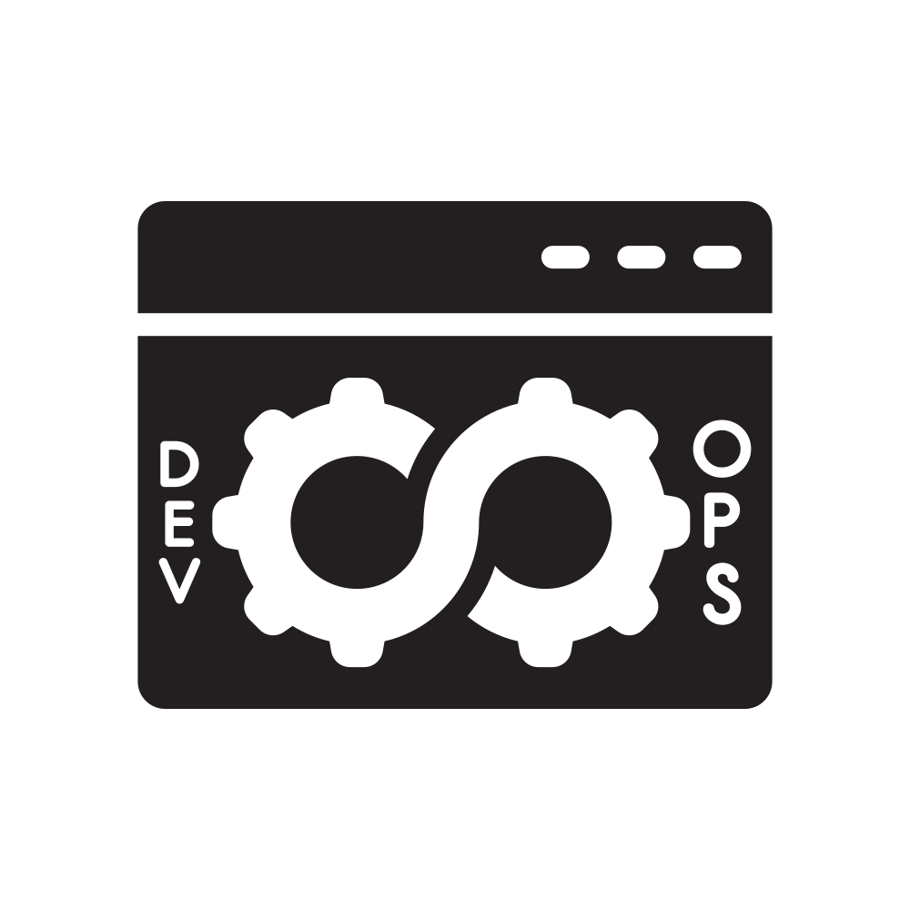

# DevOps 问题与实践

DevOps/SRE/云/网络/系统/数据库/大数据 常见面试题集合 个人汉化简化完善版

fork 自[bregman-arie/devops-exercises](https://github.com/bregman-arie/devops-exercises)

<link rel="stylesheet" href="https://cdn.jsdelivr.net/npm/bootstrap@4.4.1/dist/css/bootstrap.min.css" integrity="sha384-Vkoo8x4CGsO3+Hhxv8T/Q5PaXtkKtu6ug5TOeNV6gBiFeWPGFN9MuhOf23Q9Ifjh" crossorigin="anonymous">

<table class="table">
<tbody>
  <tr>
    <td align="center" style="width: 60px;height: 60px">
      <a href="./catagories/devops.md"> <b>DevOps</b></a>
    </td>
    <td align="center" style="width: 60px;height: 60px">
      <a href="./catagories/jenkins.md"> <b>Jenkins</b></a>
    </td>
    <td align="center" style="width: 60px;height: 60px">
      <a href="./catagories/git.md"> <b>Git</b></a> 
    </td>
    <td align="center" style="width: 60px;height: 60px">
      <a href="./catagories/ansible.md"> <b>Ansible</b></a>
    </td>
    <td align="center" style="width: 60px;height: 60px">
      <a href="./catagories/network.md"> <b>网络</b></a>
    </td>
    <td align="center" style="width: 60px;height: 60px">
      <a href="./catagories/linux.md"> <b>Linux</b></a>
    </td>
    <td align="center" style="width: 60px;height: 60px">
      <a href="./catagories/terraform.md"> <b>Terraform</b></a>
    </td>
    <td align="center" style="width: 60px;height: 60px">
      <a href="./catagories/docker.md"> <b>Docker</b></a>
    </td>
  </tr>
  <tr>
    <td align="center" style="width: 60px;height: 60px">
      <a href="./catagories/coding.md"> <b>编码</b></a>
    </td>
    <td align="center" style="width: 60px;height: 60px">
      <a href="./catagories/python.md"> <b>Python</b></a>
    </td>
    <td align="center" style="width: 60px;height: 60px">
      <a href="./catagories/go.md"> <b>Go</b></a>
    </td>
    <td align="center" style="width: 60px;height: 60px">
      <a href="./catagories/shell.md"> <b>Shell脚本</b></a>
    </td>
    <td align="center" style="width: 60px;height: 60px">
      <a href="./catagories/kubernetes.md"> <b>Kubernetes</b></a>
    </td>
    <td align="center" style="width: 60px;height: 60px">
      <a href="./catagories/prometheus.md"> <b>Prometheus</b></a>
    </td>
    <td align="center" style="width: 60px;height: 60px">
      <a href="./catagories/mongo.md"> <b>Mongo</b></a>
    </td>
    <td align="center" style="width: 60px;height: 60px">
      <a href="./catagories/sql.md"> <b>SQL</b></a>
    </td>
  </tr>
  <tr>
    <td align="center" style="width: 60px;height: 60px">
      <a href="./catagories/cloud.md"> <b>云计算</b></a>
    </td>
    <td align="center" style="width: 60px;height: 60px">
      <a href="./catagories/aws.md"> <b>AWS</b></a>
    </td>
    <td align="center" style="width: 60px;height: 60px">
      <a href="./catagories/azure.md"> <b>Azure</b></a>
    </td>
    <td align="center" style="width: 60px;height: 60px">
      <a href="./catagories/googlecloud.md"> <b>Google云平台</b></a>
    </td>
    <td align="center" style="width: 60px;height: 60px">
      <a href="./catagories/openstack.md"> <b>OpenStack</b></a>
    </td>
    <td align="center" style="width: 60px;height: 60px">
      <a href="./catagories/security.md"> <b>安全</b></a>
    </td>
    <td align="center">
      <a href="./catagories/puppet.md"> <b>Puppet</b></a>
    </td>
    <td align="center" style="width: 60px;height: 60px">
      <a href="./catagories/openshift.md"> <b>OpenShift</b></a>
    </td>
  </tr>
  <tr>
    <td align="center" style="width: 60px;height: 60px">
      <a href="./catagories/monitoring.md"> <b>监控</b></a>
    </td>
    <td align="center" style="width: 60px;height: 60px">
      <a href="./catagories/elastic.md"> <b>Elastic</b></a>
    </td>
    <td align="center" style="width: 60px;height: 60px">
      <a href="./catagories/virtualization.md"> <b>虚拟化</b></a>
    </td>
    <td align="center" style="width: 60px;height: 60px">
      <a href="./catagories/dns.md"> <b>DNS</b></a>
    </td>
    <td align="center" style="width: 60px;height: 60px">
      <a href="./catagories/os.md"> <b>操作系统</b></a>
    </td>
    <td align="center" style="width: 60px;height: 60px">
      <a href="./catagories/distributed.md"> <b>分布式</b></a>
    </td>
    <td align="center" style="width: 60px;height: 60px">
      <a href="./catagories/general.md"> <b>概述</b></a>
    </td>
    <td align="center" style="width: 60px;height: 60px">
      <a href="./catagories/hr.md"> <b>HR</b></a>
    </td>
  </tr>
  <tr>
    <td align="center" style="width: 60px;height: 60px">
      <a href="./catagories/testing.md"> <b>测试</b></a>
    </td>
    <td align="center" style="width: 60px;height: 60px">
      <a href="./catagories/databases.md"> <b>数据库</b></a>
    </td>
    <td align="center" style="width: 60px;height: 60px">
      <a href="./catagories/regex.md"> <b>正则</b></a>
    </td>
    <td align="center" style="width: 60px;height: 60px">
      <a href="./catagories/design.md"> <b>设计</b></a>
    </td>
    <td align="center" style="width: 60px;height: 60px">
      <a href="#questions-you-ask"> <b>问题</b></a>
    </td>
    <td align="center" style="width: 60px;height: 60px">
      <a href="#exercises"> <b>练习</b></a>
    </td>
  </tr>
  </tbody>
</table>

## Questions you CAN ask

A list of questions you as a candidate can ask the interviewer during or after the interview.
These are only a suggestion, use them carefully. Not every interviewer will be able to answer these (or happy to) which should be perhaps a red flag warning for your regarding working in such place but that's really up to you.

What do you like about working here?
 <b>
</b>

How does the company promote personal growth?
 <b>
</b>

What is the current level of technical debt you are dealing with?
 <b>

Be careful when asking this question - all companies, regardless of size, have some level of tech debt.
Phrase the question in the light that all companies have the deal with this, but you want to see the current
pain points they are dealing with  

This is a great way to figure how managers deal with unplanned work, and how good they are at
setting expectations with projects.
</b>

Why I should NOT join you? (or 'what you don't like about working here?')
 <b>
</b>

What was your favorite project you've worked on?
 <b>

This can give you insights in some of the cool projects a company is working on, and if
you would enjoy working on projects like these. This is also a good way to see if
the managers are allowing employees to learn and grow with projects outside of the
normal work you'd do.
</b>

If you could change one thing about your day to day, what would it be?
 <b>

Similar to the tech debt question, this helps you identify any pain points with the company.
Additionally, it can be a great way to show how you'd be an asset to the team. 

For Example, if they mention they have problem X, and you've solved that in the past,
you can show how you'd be able to mitigate that problem.
</b>

Let's say that we agree and you hire me to this position, after X months, what do you expect that I have achieved?
 <b>

Not only this will tell you what is expected from you, it will also provide big hint on the type of work you are going to do in the first months of your job.
</b>

## Exercises

Exercises are all about:

- Setting up environments
- Writing scripts
- Designing and/or developing infrastructure apps
- Fixing existing applications

Below you can find several exercises

- [Writing a Dockerfile and running a container](exercises/write_dockerfile_run_container.md)
- [Elasticsearch & Kibana on AWS](exercises/elk_kibana_aws.md)
- [ELK & Filebeat](exercises/eflk.md)
- [Ansible, Minikube and Docker](exercises/ansible_minikube_docker.md)
- [Cloud Slack bot](exercises/cloud_slack_bot.md)
- [Jenkins: writing scripts](exercises/jenkins_scripts.md)
- [Jenkins: writing pipelines](exercises/jenkins_pipelines.md)
- [CI for open source project](exercises/ci_for_open_source_project.md)
- [Flask, Containers and CI](exercises/flask_container_ci/README.md)
- [Flask, Containers and CI 2](exercises/flask_container_ci2/README.md)
